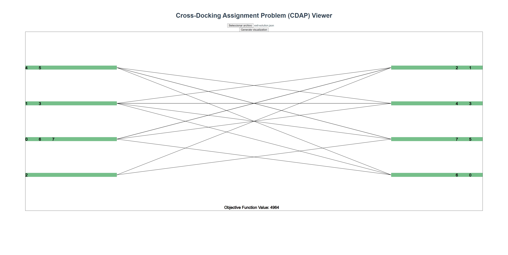

# Solution viewer <!-- omit in toc -->

- [Webpage](#webpage)
- [Project setup](#project-setup)
  - [Compiles and hot-reloads for development](#compiles-and-hot-reloads-for-development)
  - [Compiles and minifies for production](#compiles-and-minifies-for-production)
  - [Lints and fixes files](#lints-and-fixes-files)
  - [Customize configuration](#customize-configuration)

## Webpage

[Click here to access the webpage](https://virensdd.github.io/CDAP-Solution-Viewer/).

In the [test](./test) directory example inputs can be found to display. To use the application, upload a valid JSON file using the file selector, and then click the "Generate visualization" button. The output for the [exit-solution.json](./test/exit-solution.json) file would be:



## Project setup
```
npm install
```

### Compiles and hot-reloads for development
```
npm run serve
```

### Compiles and minifies for production
```
npm run build
```

### Lints and fixes files
```
npm run lint
```

### Customize configuration
See [Configuration Reference](https://cli.vuejs.org/config/).
